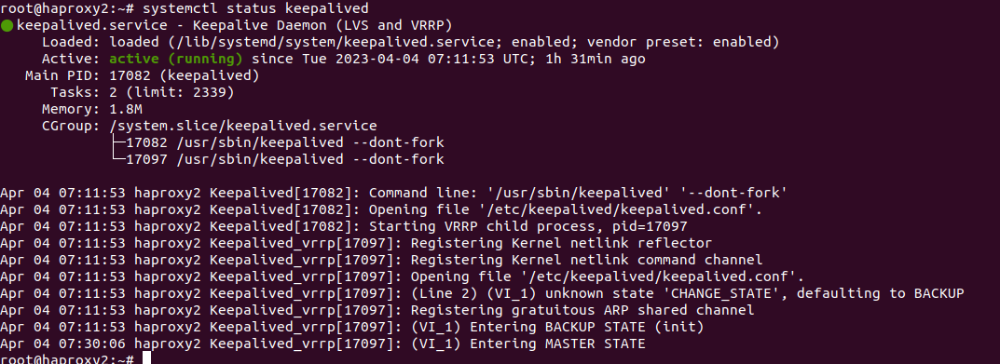

## This project deploy 9 VMs ubuntu-server 20.04 on PVE.
- 2 VMs haproxy loadbalancer
- 2 VMs frontend stateless servers with nginx web server.
- 2 VMs backend with GlusterFS cluster, which include statefull content for web servers.
- 3 VM mariadb-server, Galera cluster inside worpdpress database here.

## Create terraform.tfvars file which include:
- pve_ip_address = "IPv4" 
- pm_user = "root@pam" 
- pm_password = "PASS" 
- proxmox_host = "HOSTNAME" 
- template = "ubuntu-focal64 or you template" 
- storage = "YOUR STORAGE"

## To start deploy run:
1. terraform apply
2. ansible-playbook site.yml

## Scheme:

## Galera cluster check status from db1:

- show status like 'wsrep_cluster_status';
- show status like 'wsrep_cluster_size';
- show status like 'wsrep_local_state_comment';

### Check after crash 1 VM:

- show status like 'wsrep_cluster_status';
- show status like 'wsrep_cluster_size';
- show status like 'wsrep_local_state_comment';

- visit http://demosite.local

- All work fine!!!

## Check keepalived on haproxy2 after down haproxy1:

### haproxy2:

### haproxy1:

### Check glusterfs volume on backends nodes:

## Check glusterfs client on web servers:

### web1:

### web2:

## Check content of /srv/www/demosite.local

## Check http://demosite.local

